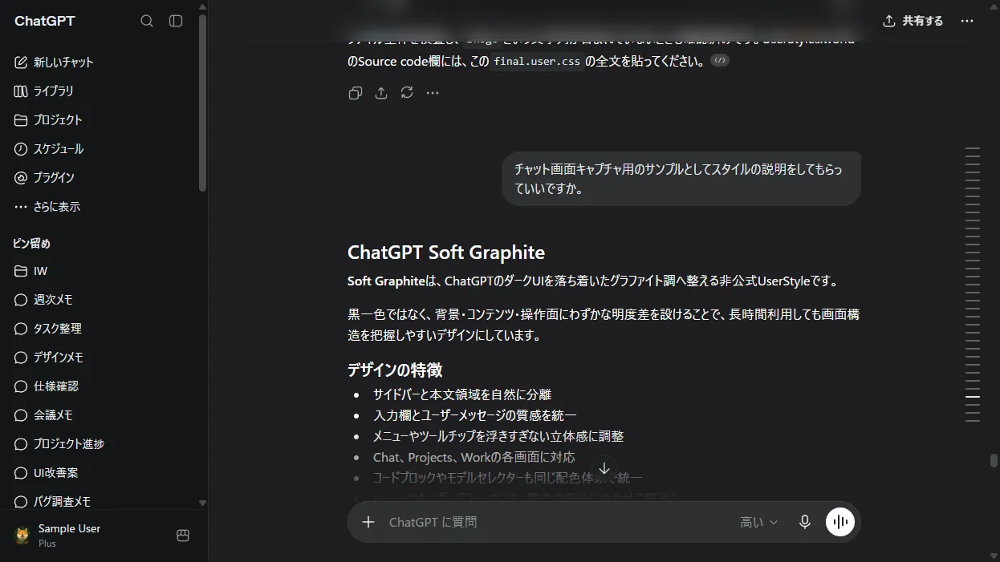

# ChatGPT Graphite Themes

Unofficial Stylus/UserCSS themes for ChatGPT.

## Install Soft Graphite

Install the current stable UserCSS directly from GitHub:

- [Install ChatGPT Soft Graphite](https://raw.githubusercontent.com/signal-forge-lab/chatgpt-graphite-theme/main/chatgpt-soft-graphite.user.css)
- [UserStyles.world mirror](https://userstyles.world/style/29175/chatgpt-soft-graphite)

The root-level `chatgpt-soft-graphite.user.css` is the canonical update source.
Stylus checks its embedded `@updateURL`, so each future release must update the
root file and increment `@version` before it is pushed.

## Stable release

The `main` branch preserves **ChatGPT Soft Graphite v1.0.26** as the current
stable release.

- Stable CSS: `releases/v1.0.26/chatgpt-soft-graphite.user.css`
- Canonical install CSS: `chatgpt-soft-graphite.user.css`
- Stable tag: `v1.0.26`
- Preview: `previews/chatgpt-soft-graphite-preview.webp`
- UserStyles.world note: `docs/USERSTYLES_WORLD_NOTE.md`

## Development lines

The `feature/standard-graphite` branch develops Standard Graphite as a
standalone UserCSS while Soft Graphite remains the stable published style.

The earlier `feature/dual-graphite-palettes` integration branch is retained but
is currently paused.

## Branch policy

- `main`: published and visually confirmed stable releases only
- `feature/standard-graphite`: standalone Standard Graphite development
- `feature/dual-graphite-palettes`: retained, currently paused
- tags: immutable published versions such as `v1.0.26`

Do not create a new branch for every patch version. Use commits and release
tags to separate versions.
